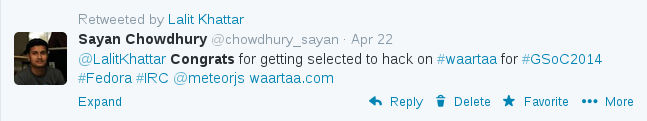

.. link: 
.. description: Waartaa gets into GSOC 2014
.. tags: waartaa,irc,gsoc,fedora,meteorjs
.. date: 2014/05/18 12:29:34
.. title: Waartaa gets into GSOC 2014
.. slug: waartaa-gets-into-gsoc-2014

`Waartaa <https://www.waartaa.com/>`_ - a web-based IRC client started out as a tool for the developers to stay online on IRC 24x7. Waartaa applied to GSoC this year under `The Fedoraproject <http://fedoraproject.org/>`_.

As soon as we proposed the idea, it received an overwhelming response from the
aspiring GSoC'ers. Waartaa received 10+ applications and the mentors had a
hard time selecting the best proposal out of it. The ideas proposed were:
 
- Build a central hub for searching/reading channel logs for Open Source communities and projects.

- Build a faster and scalable backend.
- Freedom of choice: Expose an API so that users can use their existing IRC clients with waartaa.
- Find a secure way to authenticate with IRC services without storing RAW passwords.
- Respect user privacy: user personal messages should be stored in an encrypted format in the server.
- Allow users to download chat logs in various formats compatible with popular IRC clients.
- HTML5 mobile app
- VCS, Bugzilla and other task management tools integration.
- Video/audio conference facility on top of HTML5 and JS technologies.

`Lalit Khattar <https://fedoraproject.org/wiki/User:Dne0>`_, an undergraduate student of Metallurgical Department of IIT Roorkee, India got selected as the GSoC 2014 candidate for Waartaa.

He will be building central hub for searching/reading channel logs for Open Source communities and projects and the integration of Video/Audio conference facility

What could be a better way to spend the Community Bonding Period?
It's to code as start contributing even before the actual GSoC starts.
So, Lalit Khattar started working out with writing tests for Waartaa, to
give an idea of the codebase. He will be going to start with implementing
his proposed project idea as soon as the GSoC Coding Period starts. The
next three months is going to be an awesome ride for the mentors and the
candidate.

Elasticsearch and video integration is planned to implemented after the
GSoC period.
